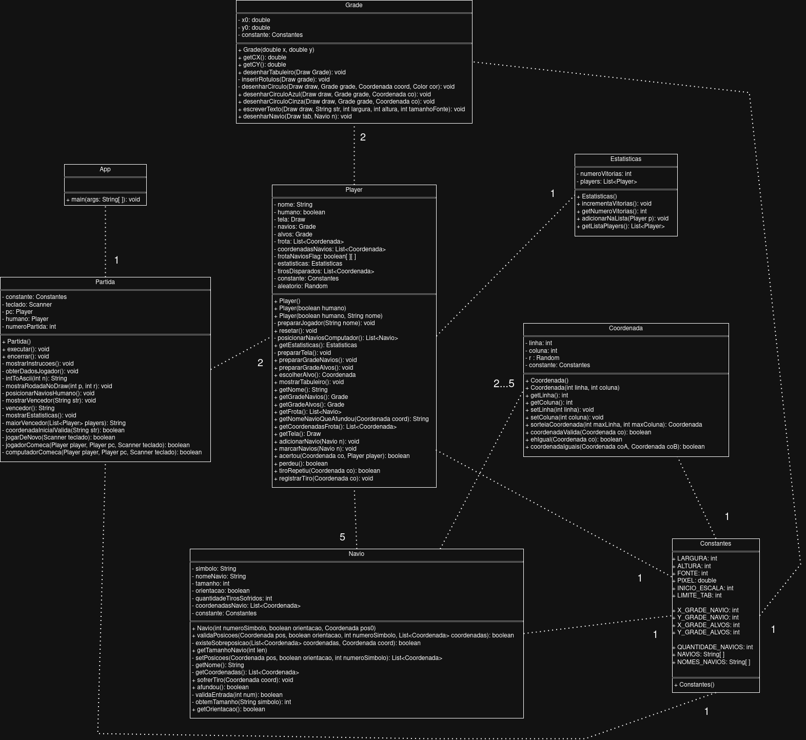
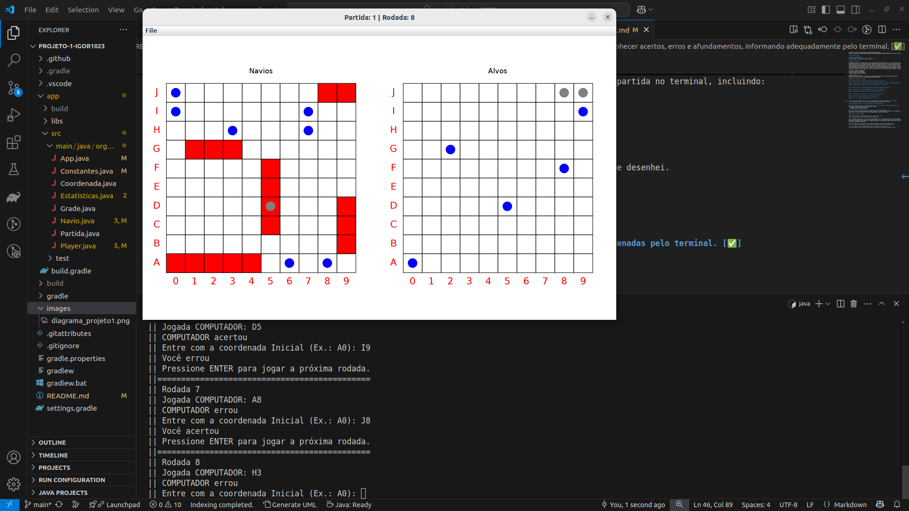

# Aluno: Igor da Silva

# Projeto 1: Batalha Naval

# Engenharia de Telecomunicações - IFSC câmpus São José

# Turma: 129003 - Programação Orientada à Objetos

## Objetivo do Projeto

Este projeto consiste no desenvolvimento de uma versão digital do jogo Batalha Naval, com Interface Gráfica de Usuário (GUI) e implementação em Java, utilizando princípios da Programação Orientada a Objetos. O jogo será disputado entre o usuário e o computador. 

A interface gráfica deverá exibir dois tabuleiros: um para os navios do usuário, com a posição de seus navios e os tiros recebidos, e outro para os seus alvos, mostrando apenas os erros e acertos disparados pelo jogador. 

A interação ocorrerá por meio de entradas em modo texto (como coordenadas para posicionar navios e disparar tiros). A biblioteca algs4 deve ser utilizada para exibir a interface gráfica. 

Ao final de cada partida, o jogo deve exibir o vencedor e perguntar se o usuário deseja jogar novamente. Caso sim, a partida recomeça alternando o primeiro jogador. Caso não, o jogo é encerrado e deve informar estatísticas da partida no terminal, incluindo:

• número total de partidas jogadas;

• número de vitórias do jogador;

• número de vitórias do computador;

• nome do jogador com mais vitórias.

## Diagrama de Classes UML
Pretendo implementar o projeto com base no que consta no diagrama de classes UML que pensei e desenhei. Diagrama implementado através do Draw.io. 
Com a correção do docente, o diagrama abaixo *ESTÁ COM ERROS*. Nos projetos posteriores, desenvolveu-se o diagrama por meio de Mermaid, com isso, verifiquei meus erros e os corrigi quando tive a oportunidade.

## Requisitos do Projeto

### 1- Jogadores devem ser capazes de posicionar seus navios de forma válida.

##### a) O usuário deve ser capaz de posicionar seus navios manualmente, informando as coordenadas pelo terminal. [✅] 

#### b) O computador deve posicionar os navios de forma automática e aleatória. [✅]

### 2- Durante o jogo, cada jogador pode disparar em uma posição tabuleiro adversário.

#### a) O usuário deve informar as coordenadas do seu alvo pelo terminal.[✅]

#### b) O computador escolhe uma coordenada válida de maneira aleatória. [✅]

### 3- A interface gráfica deve mostrar, com atualizações em tempo real:

#### a) os navios e tiros recebidos no tabuleiro de navios. [✅]

#### b) os tiros acertados e errados no tabuleiro de alvos. [✅]

### 4- O jogo deve reconhecer acertos, erros e afundamentos, informando adequadamente pelo terminal. [✅]
O jogo informa acertos e erros, tanto do computador quanto da pessoa, via terminal. 

### 5- O jogo deve informar o nome do vencedor ao final de cada partida. [✅]

### 6- Deve ser possível iniciar uma nova partida após o término da anterior, alternando quem começa. [✅]
Isto está funcionando. Contei o número de partidas jogadas:
- O Computador começa nas partidas ímpares;
- O Jogador começa nas partidas pares.

### 7- Ao sair do jogo, deve-se imprimir no terminal as estatísticas de partidas. [✅]
Para tanto, criei uma classe Estatisticas.java para exercer esta funcionalidade.

### 8- O projeto deve ser implementado em Java com uso do Gradle. [✅]
Criei o projeto Gradle antes de realizar qualquer programação.

### 9- O código deve respeitar os princípios de POO: encapsulamento, responsabilidade única, divisão adequada entre classes. [✅]
Obs.: tentei ao máximo seguir o critério de responsabilidade única, houve melhorias ao longo do desenvolvimento do projeto. Acredito, entretanto, que algumas classes possam ser criadas para diminuir a quantidade de funções que uma outra classe está exercendo, por exemplo, na App.java que gerencia a partida.

### 10- É proibido o uso de constantes literais não identificadas (use constantes nomeadas). [✅]
Criei uma classe Constantes.java para guardar TODAS as constantes que achei importante utilizar.

### 11- O código deve estar adequadamente comentado, explicando métodos e atributos. [✅]
Há trechos comentados bem como os atributos de objeto e classe.

## Captura de Tela do Jogo em Execução

## Instruções de Uso
Nesta seção, constam-se as instruções sobre como jogar a Batalha Naval implementada neste projeto.

### Início do Jogo
a) O jogo lhe solicitará seu nome: entre com um username qualquer (caso queira jogar uma nova partida, entre com este mesmo username para que o jogo não crie outras estatísticas de um outro jogador). Não se preocupe com o formato das letras, pois o jogo NÃO é case sensitive, isto é, IgoR = IGOR = igOR etc.

b) O jogo prepará a tela do JOGADOR HUMANO, mostrando o tabuleiro dos NAVIOS, à esquerda, e o tabuleiro dos ALVOS à direita.

### Posicionamento dos Navios
a) O  jogo lhe solicitarás a coordenada inicial de cada navio e a orientação (horizontal ou vertical).

b) Você deve entrar com uma coordenada no formato LETRA NÚMERO: A0 ou B4; depois a orientação: h ou H - horizontal; ou qualquer outro dígito - vertical.

c) Se você entrar com uma posição inválida ou com uma posição inicial e orientação que geram pelo menos uma posição inválida ou sobreposição, o programa lhe solicitará a posição inicial (o que está descrito no item 'b'). O computador posicionará seus navios de forma aleatória.

d) O jogo NÃO aceita sobreposições de navio nem posições que estejam foram do limite do tabuleiro (10 X 10).

### Troca de tiros

a) Após posicionar seus navios, chega-se no evento de trocas de tiros, o qual você deve atirar em uma posição válida para tentar acertar os navios do COMPUTADOR.

b) O jogo não aceita tiros repetidos nem tiros que estejam fora dos limites do tabuleiro (10 X 10). Ambos não são contabilizados se o jogador o fizer.

### Fim de Partida

a) A partida acaba quando o COMPUTADOR afundar TODOS os navios do JOGADOR (ou vice-versa), informa na tela quem venceu a partida e pergunta se você aceita jogar novamente.

b) Se a mesma pessoa quiser jogar novamente, basta entrar com 'S' e informar o MESMO USERNAME que entrou na última vez que jogou. Caso contrário, quando finalizar uma partida e não quiser jogar, o item de "Jogador com mais vitórias" não estará coerente. Portanto, entre com um USERNAME diferente do seu caso outra pessoa queira jogar também. Com isso, tem-se uma verdadeira competição e mais real.

# Conclusão

Implementou-se o projeto 1 do Programação Orientada à Objetos o qual apresenta os requisitos exigidos na proposta do projeto.

Inicialmente, foram utilizadas as classes Jogador e Computador. O professor sugeriu utilizar uma classe Jogador (nomeou-se Player) para representar tanto o Jogador humano quanto o Jogador Computador. Após implementar com aquelas duas classes e obter sucesso, juntou-se ambas classes em uma só e separaram-se os métodos através de uma variável booleana (true = humano, false = computador).

Durante a execução do projeto, procurou-se obedecer a ideia de função única, isto é, a classe deve possuir métodos que exerçam apenas funções que lhe foram atribuídas/direcionadas. Tiveram-se loops que eram repetidos ao longo da classe, então para tanto desenvolveu-se um método para resolvê-lo (verificar sobreposição de Coordenadas, por exemplo). Na própria classe Coordenada, desenvolveram-se dois métodos para comparar duas Coordenadas, visto que isto foi bastante utilizado para verificações ao longo da rotina do jogo.

O desenvolvimento contribuiu para o aprendizado do aluno, devido à complexidade de se pensar em métodos que resolvam problemas que surgiam ao longo do desenvolvimento do jogo e à toda lógica necessária para converter as ideias descritas no papel em algoritmo de programação.
